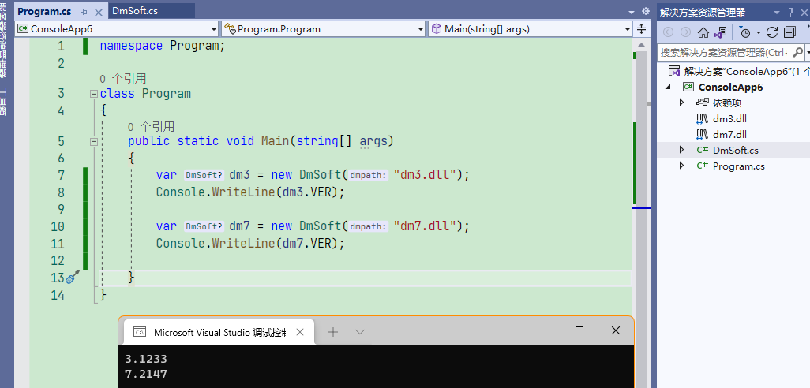

# xDM

c# / c++ 使用大漠插件. 完成 类似 按键精灵的 功能.

## !!注意

低版本的大漠只能用 32 位的程序调用,

(最新的高版本应该可以 64 位, 暂时没试过)

现在新建 C# 和 C++ 的程序, 

可能都是默认 64 位了. 

所以要手动修改程序的目标平台为 x86

## 免注册大漠

把 dm.dll 放在项目中, 直接使用, 无需其他操作

[C# 免注册大漠, 免注册调用com组件类-CSDN博客](https://blog.csdn.net/black_bad1993/article/details/53906335)

[VC++ 免注册调用大漠插件-CSDN博客](https://blog.csdn.net/chuhe163/article/details/112745590)

> (3.1235+) 高版本的大漠也可以用官方提供的DmReg.dll  调用 SetDllPathA  进行注册



## 代码注册

一定要将所有的初始化操作放在这个代码后面

```csharp
static void Main(string[] args)
{
    // 判断是否注册了大漠, 没有则执行命令注册 
    // (项目里新建一个"dll"文件夹,把dm.dll放进去,属性中选择"始终复制"))
    if (Type.GetTypeFromProgID("dm.dmsoft") == null)
    {
        // 执行cmd命令, 并打印输出 
        //  (搜索引擎随便找一个,
        // 一定要获取输出,否则还没等到注册成功,代码就继续执行了,就会初始化失败)
       ExcuteCommandOnBackgroudCaptureOutputStream("regsvr32 ./dll/dm.dll");
    }

    // 你的初始化dm代码
}
```

## 手动注册

注册 大漠 dll 到 com

资源在源码的 DLL 文件夹中

## 交流

[https://github.com/xxxxue/sponsors](https://github.com/xxxxue/sponsors)
